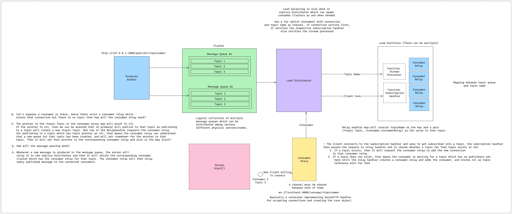

Architechture of ruskin can be found in the [Excalidraw File](https://excalidraw.com/#room=87fe025d9fe0537db706,FP3otcFfJ4qEnQnfA9ocOw)

## Architechture 

**Note:** [Google Font to Svg Path](https://danmarshall.github.io/google-font-to-svg-path/) to generate SVG from uploaded font. This is used to create ruskin logo.